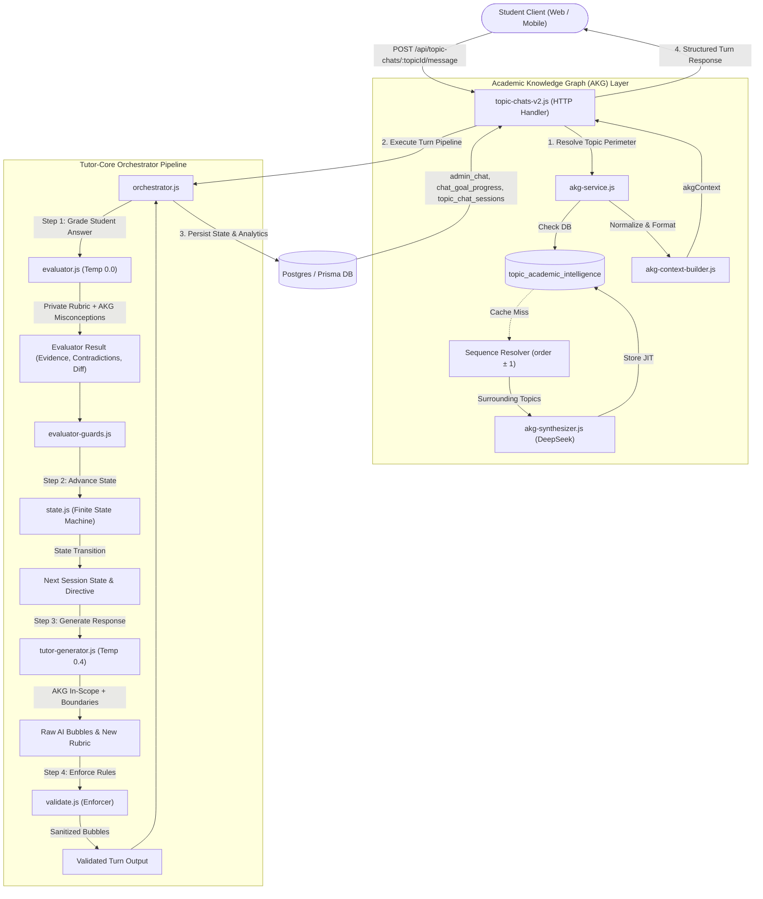
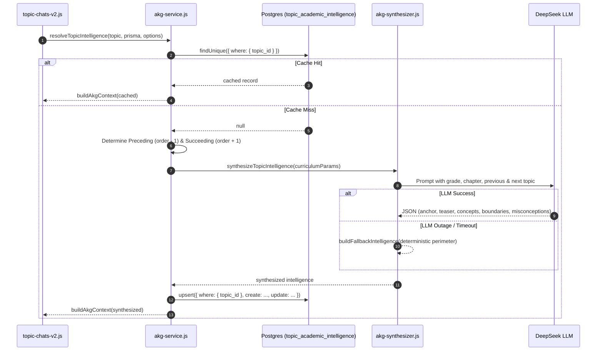
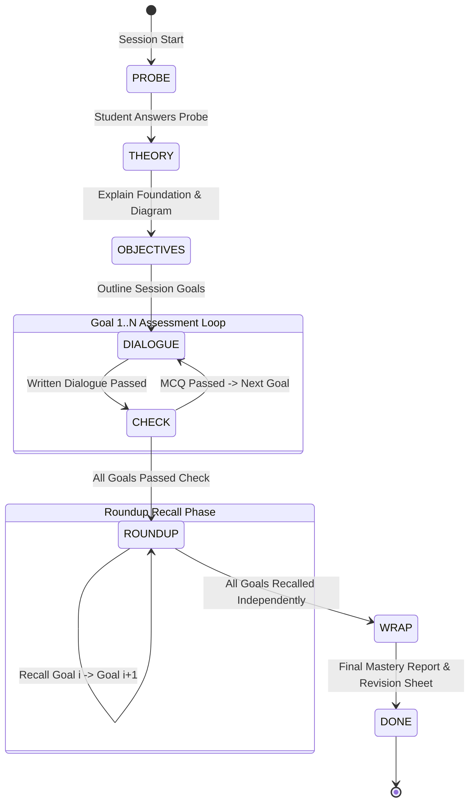

# Cloop AI Tutor: Topic Pipeline & Academic Knowledge Graph Architecture

> **Authoritative Technical Architecture Document**  
> **Scope**: AI Tutor Topic Chat Engine (V2), State Machine, Evaluator-Generator Pipeline, and Academic Knowledge Graph (AKG) Integration.

---

## 1. Executive Overview

The **Cloop AI Tutor Topic Pipeline** is an autonomous, curriculum-grounded conversational tutoring engine designed for Indian K-12 students (CBSE, ICSE, and State Boards). It delivers interactive, adaptive Socratic tutoring sessions on individual syllabus topics.

### Fundamental Architectural Tenets
1. **Server-Owned Authority**: The LLM *never* decides pedagogical progression, phase transitions, student scores, or mastery verdicts. All learning decisions are governed by a deterministic, zero-hallucination finite state machine.
2. **Pedagogical Perimeter Enforcement**: The tutor operates within strict grade-level and curriculum boundaries powered by the **Academic Knowledge Graph (AKG)**. The tutor cannot drift into concepts belonging to future chapters or higher grades (e.g., Newton's laws or inertia cannot enter Class 6 Force).
3. **Dual-Model Separation (Evaluator vs. Generator)**: Every student turn is evaluated by a cold, zero-temperature **Evaluator** against a strict rubric before the warm **Tutor Generator** crafts the next dialogue turn.
4. **Triple Assessment per Goal**: Every learning goal is assessed three distinct times across the session:
   - **Dialogue**: Written conceptual application question.
   - **Check**: Objective Multiple Choice Question (MCQ).
   - **Roundup**: Complete, uncoached active written recall of definitions, core facts, and formulas before session conclusion.
5. **Score Integrity**: Scores are never exposed mid-session and cannot be earned via coached assistance. Independent recall in the Roundup phase is required to confirm mastery.

---

## 2. High-Level System Architecture

The following diagram illustrates the complete end-to-end data flow when a student interacts with the AI Tutor:



---

## 3. Academic Knowledge Graph (AKG) Architecture

### 3.1 The Pedagogical Problem Solved
Without curriculum knowledge graph boundaries, standard LLM tutors suffer from four critical failures:
1. **Curriculum Leakage / Topic Drift**: A Class 6 tutor teaching "Force" routinely introduces inertia, Newton's 1st/2nd/3rd laws, or vector equations ($F = ma$) because foundational physics associations in LLM weights bleed into elementary topics.
2. **Disjointed Chapter Continuity**: Tutors start sessions without anchoring in what the student learned in the immediately preceding topic, and wrap sessions without teasing the succeeding topic.
3. **Unaware of Student Traps**: General evaluators fail to anticipate predictable age-specific misconceptions (e.g., believing that "force is a substance inside moving objects" or "a continuous force is needed to maintain constant speed").

### 3.2 Database Schema (`topic_academic_intelligence`)
The AKG persistence layer uses a dedicated table in `prisma/schema.prisma` with a 1-to-1 relation to `global_topics`:

```prisma
model topic_academic_intelligence {
  id                      Int           @id @default(autoincrement())
  topic_id                Int           @unique
  preceding_anchor        String?       @db.Text
  succeeding_teaser       String?       @db.Text
  in_scope_concepts       Json
  out_of_scope_boundaries Json
  common_misconceptions   Json
  created_at              DateTime?     @default(now()) @db.Timestamp(6)
  updated_at              DateTime?     @default(now()) @db.Timestamp(6)

  topic                   global_topics @relation(fields: [topic_id], references: [id], onDelete: Cascade)

  @@index([topic_id])
}
```

### 3.3 Just-In-Time (JIT) Read-Through Lifecycle
Rather than pre-seeding thousands of curriculum combinations offline, AKG uses a **reactive read-through cache**:



#### Sequence Boundary Resolution
When a topic is at the boundary of a chapter:
- If `topic.order === 1`: The service looks up `order - 1` in `global_chapters` and grabs the **last topic** of that preceding chapter as `precedingTopic`.
- If `topic` is the last in its chapter: The service queries `order + 1` in `global_chapters` and grabs the **first topic** of the subsequent chapter as `succeedingTopic`.

---

## 4. Context Building: How Context is Constructed

The module [`services/academic-graph/akg-context-builder.js`](file:///c:/cloop/backend/services/academic-graph/akg-context-builder.js) formats raw intelligence into compact, injection-safe context objects for prompt consumption:

```
Raw DB Row / Synthesized Object
  ├── preceding_anchor: "Understanding of rest and motion."
  ├── succeeding_teaser: "Contact vs non-contact forces."
  ├── in_scope_concepts: ["Push and pull", "Change in motion", "Change in shape"]
  ├── out_of_scope_boundaries: ["Newton's Laws", "Inertia", "F = ma"]
  └── common_misconceptions: [{ "misconception": "...", "correction_angle": "..." }]
```

### 4.1 Tutor Generator Ingestion (<80 words)
Formatted into `tutor_context.prompt_snippet` and injected into `turnData.academic_boundaries`:

```text
FOUNDATION: Anchor opening probe in: Understanding of rest and motion from earlier lessons.
IN-SCOPE: Push and pull, Change in motion, Change in shape
FORBIDDEN (Out-of-scope for this grade): Newton's Laws, Inertia, F = ma. DO NOT introduce, ask about, or mention these.
WRAP TEASER: Tease next topic: Contact vs non-contact forces.
```

**Rule 11 Enforced in `tutor-generator.js`**:
> *"Respect academic boundaries: strictly stay within in-scope concepts; never introduce or ask about out-of-scope/forbidden concepts for this grade level."*

### 4.2 Evaluator Ingestion (<100 words)
Formatted into `evaluator_context.prompt_snippet` and injected into `context.academic_boundaries`:

```text
IN-SCOPE: Push and pull, Change in motion, Change in shape
OUT-OF-SCOPE: Newton's Laws, Inertia, F = ma. Never penalize students for omitting these, and never require higher-grade concepts/formulas.
KNOWN MISCONCEPTIONS:
- Trap: "Force is stored inside an object" -> Scientific correction: "Force is an interaction between two bodies"
- Trap: "Motion requires continuous force" -> Scientific correction: "Force is only needed to change motion"
```

**Evaluator Prompt Constraint**:
> *"When academic_boundaries is provided in context, respect the specified boundaries: check against listed common misconceptions, and do NOT penalize students for omitting out-of-scope concepts."*

### 4.3 Opening Greeting / Probe Ingestion
When a user launches a new topic session (`GET /api/topic-chats/:topicId`), [`services/topic-chat/topic-chat-helpers.js`](file:///c:/cloop/backend/services/topic-chat/topic-chat-helpers.js) ingests the anchor:
```text
PRIOR KNOWLEDGE ANCHOR: The student previously learned: "Understanding of rest and motion".
Anchor the probe question in this prior knowledge without re-teaching it.
```

---

## 5. The 4-Stage Turn Execution Pipeline

Every message received in `POST /api/topic-chats/:topicId/message` executes through four coordinated stages inside [`services/tutor-core/orchestrator.js`](file:///c:/cloop/backend/services/tutor-core/orchestrator.js):

```mermaid
graph LR
    subgraph S1 [Stage 1: Evaluator]
        E1[normalizeRubric] --> E2[invokeModel Temp 0.0]
        E2 --> E3[applyGradingGuards]
    end

    subgraph S2 [Stage 2: State Engine]
        E3 --> S2A[advance State Machine]
        S2A --> S2B[instructionFor Directive]
        S2B --> S2C[compute Scored Progress]
    end

    subgraph S3 [Stage 3: Tutor Generator]
        S2C --> G1[buildTutorPrompt]
        G1 --> G2[invokeModel Temp 0.4]
        G2 --> G3[Generate Private Rubric]
    end

    subgraph S4 [Stage 4: Validator]
        G3 --> V1[enforce Word Limits]
        V1 --> V2[Strip Unearned Praise]
        V2 --> V3[Ensure Terminal Question]
    end

    S1 --> S2 --> S3 --> S4
```



### Stage 1: The Evaluator (`evaluator.js`)
- Runs with `temperature: 0.0` for deterministic, reproducible assessment.
- **Rubric-Driven**: Evaluates *only* the specific question asked and its stored rubric (`lastQuestionRubric`).
- **Semantic Evidence**: The LLM extracts quotes from the student's answer proving each rubric criterion is satisfied or missing.
- **Scientific Contradictions**: Detects contradictions even if partial facts are correct.
- **Guards (`evaluator-guards.js`)**:
  - English/grammar/spelling mistakes cannot cause a content failure.
  - Safe HTML diff generation (`<del>` and `<ins>` tags under 15 words).
  - Deterministic MCQ key evaluation: if the question was an MCQ, code grades the key directly without relying on LLM semantic parsing.

### Stage 2: The Finite State Machine (`state.js`)
The session transitions strictly through deterministic phases:



- **Assistance Tracking**: If a student is wrong, requests help, or states "I don't know", the engine assigns assistive directives (`correct_and_reask`, `reteach_new_angle`, `hint_then_easier`). Assistance flags the question slot as assisted, preventing unearned mastery credit.
- **Turn Cap**: Strict ceiling stops runaway sessions.

### Stage 3: The Tutor Generator (`tutor-generator.js`)
- Generates speech bubbles obeying strict pedagogical rules:
  - Max 1–2 message bubbles per turn.
  - Strict maximum of **19 words per bubble**.
  - Punctuation guarantee: final bubble must end with a focused question and `?`.
  - Praise reconciliation: Earned praise only if `previous_evaluation.is_correct === true`. "Well done" or "Exactly right" on incorrect/assisted turns is strictly forbidden.
- Generates a **private grading rubric** (`lastQuestionRubric`) for the question it just asked, persisting criteria into session state for Stage 1 of the student's next turn.

### Stage 4: The Enforcer / Validator (`validate.js`)
- Sanitizes and enforces format rules before output can reach the client:
  - Word count clamping.
  - Strips stray MCQ options during written phases.
  - Strips unearned praise from prose.
  - Replaces broken model output with grounded curriculum fallbacks.

---

## 6. Data Model & State Persistence

### Core Database Entities

| Table | Purpose | AKG Relationship |
|---|---|---|
| `global_topics` | Authoritative curriculum topic catalog | 1-to-1 with `topic_academic_intelligence` |
| `global_chapters` | Chapter organization with sequential `order` | Used to compute preceding & succeeding chapter topics |
| `global_topic_goals` | Concrete learning objectives for each topic | 2 to 5 goals per topic |
| `topic_academic_intelligence` | Persistent AKG perimeter & misconceptions cache | Owned by `services/academic-graph` |
| `admin_chat` | Storage of every chat message, options, and HTML diffs | Stores turn history and state snapshots |
| `topic_chat_sessions` | High-level session tracking, completion status, scores | Updated at session WRAP/DONE |
| `chat_goal_progress` | Per-user progress on individual topic goals | Updated on each evaluated turn |

### Session State JSON Structure (Persisted in `admin_chat.diff_html` on turn boundaries)
```json
{
  "phase": "DIALOGUE",
  "goalIndex": 0,
  "questionSlot": "DIALOGUE",
  "questionAssisted": false,
  "turnCount": 4,
  "tallies": { "dialogue": 1, "check": 0, "roundup": 0 },
  "lastQuestionText": "What happens to a football when you kick it?",
  "lastQuestionType": "open",
  "lastQuestionRubric": {
    "criteria": [
      { "id": "fact_1", "description": "Mentions that it starts moving or changes speed", "required": true }
    ],
    "model_answer": "It starts moving and changes its speed and direction."
  },
  "wrapArtifacts": null
}
```

---

## 7. Directory Structure & Key Files

```
c:\cloop\backend\
├── api\
│   └── topic-chats\
│       ├── topic-chats-v2.js          # Main POST message HTTP entry point (Tutor V2)
│       ├── topic-chats.js             # GET session init & initial greeting endpoint
│       └── topic-chats-v2.test.js     # API integration regression tests
│
├── services\
│   ├── academic-graph\                # [NEW] Academic Knowledge Graph Module
│   │   ├── akg-context-builder.js     # Prompt snippet builders (<80w tutor, <100w eval)
│   │   ├── akg-synthesizer.js         # JIT LLM synthesizer + fallback perimeter
│   │   ├── akg-service.js             # Read-through cache & sequence resolver
│   │   └── akg-service.test.js        # Dedicated AKG test suite (7 tests)
│   │
│   ├── tutor-core\                    # Core Tutoring Pipeline
│   │   ├── orchestrator.js            # 4-stage turn coordinator
│   │   ├── evaluator.js               # Zero-temp semantic grading engine
│   │   ├── evaluator-guards.js        # Spelling/HTML diff grading guards
│   │   ├── state.js                   # Deterministic Finite State Machine
│   │   ├── tutor-generator.js         # Bubble generation + rubric creator
│   │   ├── validate.js                # Sanitizer, word limiter & fallback builder
│   │   ├── summary.js                 # Mastery scoring and final report generator
│   │   ├── revision-generator.js      # Post-session revision study sheet generator
│   │   └── diagram-cache.js           # Mermaid concept diagram resolver
│   │
│   └── topic-chat\
│       ├── topic-chat-helpers.js      # Greeting generator & goal validators
│       └── topic-chat.js              # Legacy helper exports
│
└── prisma\
    └── schema.prisma                  # Authoritative Prisma schema with AKG model
```

---

## 8. Verification & Test Suite Summary

The entire tutor pipeline is protected by **16 independent test suites** running **178+ unit and integration tests** with 100% offline determinism (no live API or DB dependencies in test runners):

```powershell
# To execute all tutor test suites:
node services/academic-graph/akg-service.test.js
node services/tutor-core/diagram-cache.test.js
node services/tutor-core/evaluator.test.js
node services/tutor-core/orchestrator.test.js
node services/tutor-core/pipeline.test.js
node services/tutor-core/public-feedback.test.js
node services/tutor-core/regression.test.js
node services/tutor-core/revision-generator.test.js
node services/tutor-core/scoring.test.js
node services/tutor-core/simulate.test.js
node services/tutor-core/state.test.js
node services/tutor-core/tutor-generator.test.js
node services/tutor-core/validate.test.js
node services/topic-chat/topic-chat-helpers.test.js
node services/goal-pipelines.test.js
node api/topic-chats/topic-chats-v2.test.js
```

### Coverage Highlights
- **AKG Tests**: Validates normalization, prompt snippet sizing, cache hit/miss semantics, boundary lookups, and DB failover resilience.
- **Evaluator Tests**: Validates rubric fidelity, MCQ keys, denial of fabricated credit, contradiction detection, and HTML sanitization.
- **Generator Tests**: Validates 19-word limits, terminal question punctuation, praise reconciliation, and anti-leakage in Roundup recall.
- **State Machine Tests**: Validates phase transitions, triple assessment tallies, assistance flagging, and session termination.
